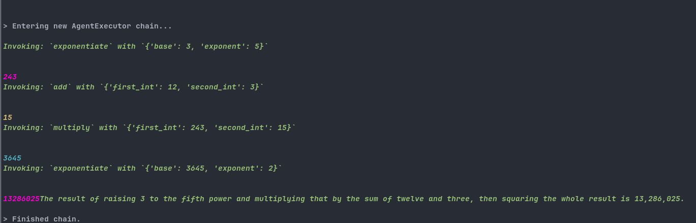

# Enhancing the Code Experience via LLMS: An Overview

## 1. State of the Art

Over the past two to three years, following the emergence of ChatGPT, significant efforts have been directed by the AI community toward incorporating Language Model Systems (LLMS) into various aspects of daily computer interaction and digital spaces in general. Many AI applications aim not only to facilitate interactions with models (e.g., through shortcuts in chat interfaces or integration into search engines like Microsoft Bing) but also to enable models to interact with systems through the use of "actions": simple tools that LLMS can utilize to obtain specific results (e.g., performing web searches or utilizing certain functions within applications). The current state of the art in this type of interaction relies on formatting the LLMS output as JSON, which can then be parsed to execute the correct action and return the result as the next prompt to the model. This approach allows the model to utilize the "chain of thought" technique to perform desired tasks, even if this involves calling multiple actions and performing various transformations on the output. However, a drawback of this approach is that standard LLMS often do not produce well-formatted JSON, rendering it impossible to use standard programming languages to parse the output and execute the desired action. To address this issue, a new form of fine-tuning has emerged, wherein the model is trained to output only well-formatted JSON and to enhance its reasoning capabilities through the use of the chain of thought. Notable models trained in this manner include GPT3.5, GPT4, and Mixtral47b. However, none of these models have provided datasets to replicate the training. Academic research has dedicated efforts to creating datasets and benchmarks to replicate the results of LLMS developed by private companies.

## 2. Problems to Address with the Current Approach

### 2.1 Costs and Execution Time

Although the chain of thought technique yields outstanding results, it also has a major drawback: the number of prompts needed to perform the desired action. Even for simple actions, the model may require as many as five or six prompts to achieve the desired result. For example, consider GPT3.5-turbo solving the following prompt: ```Take 3 to the fifth power and multiply that by the sum of twelve and three, then square the whole result``` The solution to this code took 23 seconds on a free-tier account of OpenAI. In addition to long execution times, there are also cost implications associated with this approach, both in terms of power consumption and monetary expenses. Furthermore, larger models tend to perform better, making it challenging to achieve compelling performance in a local environment. This often necessitates reliance on cloud-based models or the need to purchase dedicated machines for such tasks.

### 2.2 Lack of Projects on Open Models

The AI community working on LLMS projects currently focuses solely on using GPT models. This makes it difficult to migrate existing tools for use with open models because most prompts need to be recalibrated to perform optimally with the chosen model. This bias towards OpenAI models may stem from their ease of use and minimal hardware requirements. An example of this bias can be found in Langchain, an open-source library for developing LLMS-based applications with a strong emphasis on GPT and the integration of local models as an afterthought.

### 2.3 Usability Concerns

While many projects attempt to integrate LLMS with standard computer applications, few prioritize user interface and usability. Most applications are either chat-based or command-line-based. However, this approach may be inefficient, as standard tools are optimized for use within their respective contexts (i.e., CLI or desktop applications), whereas natural language interactions are typically less efficient. For instance, consider the compilation of a file via GCC: a command-line interface (CLI) command is much easier and faster to execute compared to formulating a prompt for an LLMS:
- LLM prompt: compile the file main.c into a program called my_program. Use GCC and the O3 optimization strategy
- cli command: gcc -o my_program main.c -O3

The better products in this regard integrate LLMS as a tool that suggests actions rather than needing to be explicitly called, similar to how Copilot suggests code. In this sense, LLMS can be viewed as an additional linter atop standard ones.

## Some Useful Links:

- [Agent Instruct](https://huggingface.co/datasets/THUDM/AgentInstruct): An open dataset for fine-tuning agent-based LLMS.
- [Agent LLMS](https://arxiv.org/abs/2310.12823): An open-source LLMS from the creators of Agent Instruct, fine-tuned from Llama-2.
- [Agent Bench](https://arxiv.org/abs/2308.03688): A benchmark for action-based LLMS.
- [Sourcegraph Cody](https://sourcegraph.com): A VS Code extension that utilizes GPT3.5 to suggest code to the user.
- [GPT-Pilot](https://github.com/Pythagora-io/gpt-pilot): An open-source VS Code extension that allows users to prompt with an application idea and lets the model generate the code for it.
- [Self-Operating Computer](https://github.com/OthersideAI/self-operating-computer): An application that enables the model to fully operate the user's operating system.
